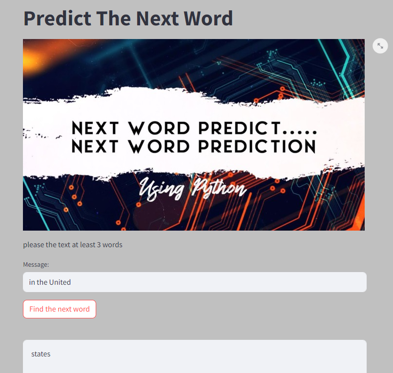

# DL-Next-Word-Prediction

Deep Learning (DL): 🤖
TensorFlow: 🔧
Keras: 🧩
Next Word Prediction : 📝
Model Saving: 💾
Streamlit: 🌐

# Table of Contents

- [Overview](#overview)
- [Project Highlights](#Project-Highlights)
- [Installation](#Installation)
- [Usage](#Usage)
- [Sample Questions](#Sample-Questions)
- [Contribution](#contribution)
- [License](#license)
- [Contact](#contact)

## Overview 
In this project,Next word prediction using Deep Learning, Recurrent Neural Networks (RNNs), and Long Short-Term Memory (LSTM) models 
involves training on large text datasets to learn the context and dependencies between words, 
enabling the generation of coherent and contextually relevant text..


  
## Project Highlights

If given the three words of a sentence, it should be able to guess the fourth

## Installation

1. Clone this repository to your local machine using:

```bash
  git clone https://github.com/alexvatti/DL-Next-Word-Prediction.git
```
2. Navigate to the project directory:

```bash
  cd DL-Next-Word-Prediction
```
3. Install the required dependencies using pip:

```bash
  pip install -r requirements.txt
```

4. Open the Jupyter Notebook /Google Colab - Run the Code

```   
DL-Next-Word-Prediction.ipynb.ipynb
Pride and Prejudice.txt
```

## Usage

1. Run the Streamlit app by executing:
```bash
next_word_model.h5 and next_word_model.keras
token.pkl
copy to App/Pre-Built-Models
cd App
streamlit run app.py
```

2.The web app will open in your browser where you can ask questions

## Sample Questions

- The Project Gutenberg eBook of Pride and Prejudice This ebook is for the use of anyone anywhere in the United States and most other parts of the world at no cost and with almost no restrictions whatsoever. You may copy it, give it away or re-use it under the terms of the Project Gutenberg License included with this ebook or online at www.gutenberg.org. If you are not located in the United States, you will have to check the laws of the country where you are located before using this eBook


## Contribution

Feel free to contribute and enhance the project!

## License
This project is licensed under the [MIT License](LICENSE).

## Contact
For any inquiries or issues, please contact Alex at alexvatti@gmail.com
